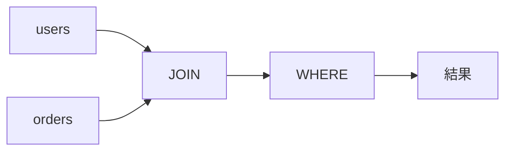

<!-- _class: title -->

# SQL 基礎

集合、結合、集約、NULL、制約を実務で誤解しやすい点から整理する。

- 本文資料: `docs/db/sql-basics.md`
- 対象: SQL + relational database
- まず全体像、次に実務の判断、最後に確認手順を押さえる
- 各章では、現場で起こりやすい状況と小さなサンプルを一緒に見る

---

## 全体像



この図を入口に、どこで何を判断するかを追っていく。

> 実務例: SQL 基礎の相談を受けたら、まず図のどの場所で問題が起きているかを言葉にする。

---

## SELECT

- 必要な列を選ぶ。`*` は調査では便利だがAPIでは避ける。
- 取得列が多いと通信量、メモリ、画面表示の責務が増える。

> 実務例: 一覧画面では表示に必要なid、名前、状態だけを取り、不要な列を持ち込まない。

```
SELECT id, name, email
FROM users
WHERE active = true;
```

---

## WHERE

- 条件は日本語の仕様に戻して読める形にする。
- 日付範囲は境界を明確にする。

> 実務例: 月次レポートでは開始日以上、翌月開始日未満で期間を指定して境界ミスを防ぐ。

```
SELECT id, total
FROM orders
WHERE ordered_at >= '2026-06-01'
  AND ordered_at <  '2026-07-01';
```

---

## JOIN

- 結合条件を明示する。行数が増える理由を考える。
- 1対多をJOINすると、親の行は増えて見える。

> 実務例: ユーザーと注文を結合すると、注文数の分だけユーザー行が増えることを先に説明する。

```
SELECT u.name, o.id, o.total
FROM users u
JOIN orders o ON o.user_id = u.id;
```

---

## LEFT JOIN

- 関連データがない行も残したいときに使う。
- WHEREに右表の条件を書くとINNER JOINのように絞られることがある。

> 実務例: 注文がないユーザーも一覧に出したいとき、LEFT JOINで親の行を残す。

```
SELECT u.id, u.name, o.id AS order_id
FROM users u
LEFT JOIN orders o ON o.user_id = u.id;
```

---

## 集約

- group by の粒度を意識する。
- 集約前の行数と集約後の行数を比べる。

> 実務例: ユーザー別の注文回数や合計金額を出し、ダッシュボードの指標に使う。

```
SELECT user_id, count(*) AS order_count, sum(total) AS total_amount
FROM orders
GROUP BY user_id;
```

---

## HAVING

- 集約後の条件はHAVINGに書く。
- WHEREは集約前、HAVINGは集約後。

> 実務例: 注文が3回以上あるユーザーだけを抽出するとき、集約後の条件として書く。

```
SELECT user_id, count(*) AS order_count
FROM orders
GROUP BY user_id
HAVING count(*) >= 3;
```

---

## NULL

- unknown と空文字は違う。比較に注意する。
- `= NULL` ではなく `IS NULL` を使う。

> 実務例: 退会していないユーザーを探すとき、deleted_atがNULLかどうかを見る。

```
SELECT id, name
FROM users
WHERE deleted_at IS NULL;
```

---

## ORDER BY と LIMIT

- 並び順がないLIMITは結果が安定しない。
- ページングでは一意な並びを作る。

> 実務例: 最新20件を安定して返すために、作成日時とidで一意に並べる。

```
SELECT id, created_at
FROM orders
ORDER BY created_at DESC, id DESC
LIMIT 20;
```

---

## INSERT / UPDATE

- 更新はWHEREを必ず確認する。
- 本番では更新前に対象件数をSELECTで見る。

> 実務例: 一括更新の前に対象件数をSELECTで見て、想定外の全件更新を防ぐ。

```
SELECT count(*) FROM users WHERE active = false;
UPDATE users SET active = true WHERE active = false;
```

---

## 制約

- アプリだけでなくDBにも守るべきルールを置く。
- NOT NULL、UNIQUE、FOREIGN KEYはデータの最後の砦。

> 実務例: メール重複をアプリだけで防がず、DBのUNIQUE制約でも守る。

```
ALTER TABLE users ADD CONSTRAINT users_email_unique UNIQUE (email);
```

---

## SQLレビュー

- 行数、index、NULL、JOIN粒度、更新範囲を見る。
- 遅いSQLだけでなく、間違った件数を返すSQLも危険。

> 実務例: PRでは行数、JOIN粒度、NULL条件、EXPLAINを見て、正しさと速度を確認する。

```
EXPLAIN SELECT * FROM orders WHERE user_id = 1;
SELECT count(*) FROM orders WHERE user_id = 1;
```

---

## 実務で使う場面

- データ取得、更新、性能、ロックを、SQLと実行計画から判断する場面で使う。
- 正しさ、件数、速度、同時実行の4つを分けて見ると改善しやすい。

- この教材では **SQL 基礎** を SQL + relational database の文脈で扱う。

---

## 判断の順番

- まず取得したい行と列を明確にする。
- 次にEXPLAINで読み方と行数を確認する。
- 最後にindex、SQL、transaction境界のどれを変えるか決める。

---

## サンプル確認

手元では、小さく動かして結果を見るところから始める。

```sh
EXPLAIN SELECT * FROM orders WHERE user_id = 1;
CREATE INDEX idx_orders_user_id ON orders(user_id);
```

---

## よくある失敗

- SELECT *で不要な列まで取る
- N+1をログで確認しない
- 長いtransactionでロック待ちを増やす

---

## チェックリスト

- EXPLAINで推定行数と利用indexを見る
- 実際の件数と処理時間を測る
- transactionを短くし、ロック順をそろえる

---

## ミニ演習

- 小さなテーブルでJOINとGROUP BYを書く
- index追加前後のEXPLAINを比べる
- 同じ順番で更新する処理に直す

---

## まとめ

- 目的と境界を先に決める
- 状態を確認してから変更する
- 具体例で動かし、ログや結果で確かめる
- 危険な操作は影響範囲を確認する
