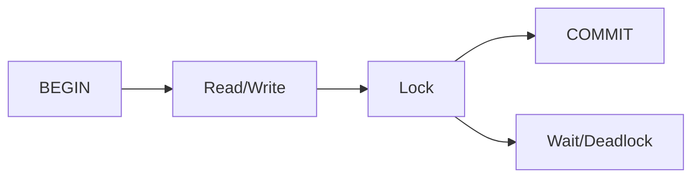

<!-- _class: title -->

# トランザクション/ロック/チューニング

分離レベル、ロック、デッドロック、運用時のチューニング判断を扱う。

- 本文資料: `docs/db/transaction-lock-tuning.md`
- 対象: RDB transaction + lock
- まず全体像、次に実務の判断、最後に確認手順を押さえる
- 各章では、現場で起こりやすい状況と小さなサンプルを一緒に見る

---

## 全体像



この図を入口に、どこで何を判断するかを追っていく。

> 実務例: トランザクション/ロック/チューニングの相談を受けたら、まず図のどの場所で問題が起きているかを言葉にする。

---

## 分離レベル

- READ COMMITTED、REPEATABLE READ などの違いを理解する。

> 実務例: 分離レベルでは、遅い検索や件数ずれをSQL、実行計画、実データから説明できるようにする。

```
SET TRANSACTION ISOLATION LEVEL READ COMMITTED;
```

---

## ロック

- 更新対象、範囲、順番で待ちが発生する。

> 実務例: ロックでは、遅い検索や件数ずれをSQL、実行計画、実データから説明できるようにする。

```
SELECT ... FOR UPDATE
```

---

## デッドロック

- 複数処理が逆順にロックすると起きやすい。

> 実務例: デッドロックでは、遅い検索や件数ずれをSQL、実行計画、実データから説明できるようにする。

```
transaction A: user -> order
transaction B: order -> user
```

---

## 改善

- 短い transaction、同じロック順、適切な index。

> 実務例: 改善では、遅い検索や件数ずれをSQL、実行計画、実データから説明できるようにする。

```
commit early
retry on deadlock
```

---

## 実務で使う場面

- データ取得、更新、性能、ロックを、SQLと実行計画から判断する場面で使う。
- 正しさ、件数、速度、同時実行の4つを分けて見ると改善しやすい。

- この教材では **トランザクション/ロック/チューニング** を RDB transaction + lock の文脈で扱う。

---

## 判断の順番

- まず取得したい行と列を明確にする。
- 次にEXPLAINで読み方と行数を確認する。
- 最後にindex、SQL、transaction境界のどれを変えるか決める。

---

## サンプル確認

手元では、小さく動かして結果を見るところから始める。

```sh
EXPLAIN SELECT * FROM orders WHERE user_id = 1;
CREATE INDEX idx_orders_user_id ON orders(user_id);
```

---

## よくある失敗

- SELECT *で不要な列まで取る
- N+1をログで確認しない
- 長いtransactionでロック待ちを増やす

---

## チェックリスト

- EXPLAINで推定行数と利用indexを見る
- 実際の件数と処理時間を測る
- transactionを短くし、ロック順をそろえる

---

## ミニ演習

- 小さなテーブルでJOINとGROUP BYを書く
- index追加前後のEXPLAINを比べる
- 同じ順番で更新する処理に直す

---

## まとめ

- 目的と境界を先に決める
- 状態を確認してから変更する
- 具体例で動かし、ログや結果で確かめる
- 危険な操作は影響範囲を確認する
