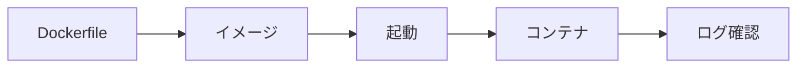

<!-- _class: title -->

# Docker の使い方

アプリと実行環境をまとめて扱い、開発と検証を再現しやすくする。

- 本文資料: `docs/fundamentals/docker.md`
- 対象: Docker + Compose + Node/PostgreSQL
- まず全体像、次に実務の判断、最後に確認手順を押さえる
- 各章では、現場で起こりやすい状況と小さなサンプルを一緒に見る

---

## 全体像



この図を入口に、どこで何を判断するかを追っていく。

> 実務例: Docker の使い方の相談を受けたら、まず図のどの場所で問題が起きているかを言葉にする。

---

## 何が楽になるか

- ランタイム、DB、Nginx などを同じ手順で起動できる。
- ローカル、CI、検証環境の差を小さくできる。
- ただし volume と port は外側に影響するので丁寧に扱う。

> 実務例: 何が楽になるかでは、レビュー前の確認や障害調査で「今どんな状態か」を説明するために使う。

---

## image と container

- image は実行環境の雛形。
- container は image から起動したプロセス。
- Dockerfile は image の作り方。

> 実務例: image と containerでは、レビュー前の確認や障害調査で「今どんな状態か」を説明するために使う。

```
Dockerfile -> image -> container
 設計図        雛形       実際に動くプロセス
```

---

## 状態を見る

- 詰まったらまず状態を見る。
- 起動中 container、手元の image、Docker 自体の情報を確認する。

> 実務例: 状態を見るでは、レビュー前の確認や障害調査で「今どんな状態か」を説明するために使う。

```sh
docker version
docker info
docker ps
docker images
```

---

## run の基本

- 名前、port、image を指定して起動する。
- host 側と container 側の port の向きを間違えない。

> 実務例: run の基本では、レビュー前の確認や障害調査で「今どんな状態か」を説明するために使う。

```sh
docker run --name web -p 8080:80 nginx:1.27
```

---

## ログと中身

- ログで起動エラーを見る。
- exec は原因確認用。container 内の手修正は再作成で消える。

> 実務例: ログと中身では、レビュー前の確認や障害調査で「今どんな状態か」を説明するために使う。

```sh
docker logs web
docker logs -f --tail=100 web
docker exec -it web sh
```

---

## Dockerfile の順番

- 依存関係を先に入れ、アプリ本体をあとでコピーする。
- layer cache が効きやすくなる。

> 実務例: Dockerfile の順番では、レビュー前の確認や障害調査で「今どんな状態か」を説明するために使う。

```Dockerfile
FROM node:24-bookworm-slim
WORKDIR /app
COPY package.json pnpm-lock.yaml ./
RUN corepack enable && pnpm install --frozen-lockfile
COPY . .
RUN pnpm build
CMD ["pnpm", "start"]
```

---

## multi-stage build

- build 用の依存を最終 image に入れない。
- image を小さくし、実行時に不要なツールを減らす。

> 実務例: multi-stage buildでは、レビュー前の確認や障害調査で「今どんな状態か」を説明するために使う。

```Dockerfile
FROM node:24-bookworm-slim AS build
WORKDIR /app
COPY . .
RUN corepack enable && pnpm install --frozen-lockfile && pnpm build

FROM nginx:1.27-alpine
COPY --from=build /app/dist/site /usr/share/nginx/html
```

---

## .dockerignore

- build context を小さくし、秘密情報を送らない。
- node_modules や .git は基本的に除外する。

> 実務例: .dockerignoreでは、レビュー前の確認や障害調査で「今どんな状態か」を説明するために使う。

```dockerignore
node_modules/
dist/
.git/
.env
tmp/
```

---

## Compose でまとめる

- アプリ、DB、Nginx など複数 container をまとめて扱う。
- service 名で通信できる。

> 実務例: Compose でまとめるでは、レビュー前の確認や障害調査で「今どんな状態か」を説明するために使う。

```yaml
services:
  app:
    build: .
    ports:
      - "8080:3000"
  db:
    image: postgres:17
    volumes:
      - db-data:/var/lib/postgresql/data
volumes:
  db-data:
```

---

## volume

- DB データなどを container の外に残す。
- container を消しても volume は残る。
- `down -v` はデータも消す。

> 実務例: volumeでは、レビュー前の確認や障害調査で「今どんな状態か」を説明するために使う。

```sh
docker volume ls
docker volume inspect db-data
docker compose down -v
```

---

## network

- 同じ user-defined network の container は service 名で通信できる。
- 別 container の DB へ `localhost` ではつながらない。

> 実務例: networkでは、レビュー前の確認や障害調査で「今どんな状態か」を説明するために使う。

```
postgres://app:app-password@db:5432/app
```

---

## healthcheck

- 起動したことと使えることは別。
- healthcheck で依存関係や監視の判断材料を作る。

> 実務例: healthcheckでは、レビュー前の確認や障害調査で「今どんな状態か」を説明するために使う。

```yaml
services:
  app:
    healthcheck:
      test: ["CMD", "curl", "-fsS", "http://localhost:3000/health"]
      interval: 30s
      timeout: 3s
      retries: 3
```

---

## secret と環境変数

- secret を image に焼き込まない。
- .env を commit しない。
- ログに secret を出さない。

> 実務例: secret と環境変数では、レビュー前の確認や障害調査で「今どんな状態か」を説明するために使う。

```yaml
services:
  app:
    environment:
      APP_ENV: local
      PORT: "3000"
```

---

## 掃除と危険操作

- 未使用 resource は増える。
- prune は便利だが volume 削除に注意する。

> 実務例: 掃除と危険操作では、レビュー前の確認や障害調査で「今どんな状態か」を説明するために使う。

```sh
docker system df
docker system prune
docker system prune -a --volumes
```

---

## トラブルの見方

- container が起動しているか、ログ、port、アプリ応答の順に見る。

> 実務例: トラブルの見方では、レビュー前の確認や障害調査で「今どんな状態か」を説明するために使う。

```sh
docker compose ps
docker compose logs -f app
docker port app
curl -v http://localhost:8080
```

---

## 実務で使う場面

- アプリ、DB、Nginxなどを同じ手順で起動し、開発環境を再現する場面で使う。
- CIや検証環境で、依存関係と実行手順を揃えるために使う。

- この教材では **Docker の使い方** を Docker + Compose + Node/PostgreSQL の文脈で扱う。

---

## 判断の順番

- imageとcontainerを分けて考える。
- port、volume、networkを起動前に確認する。
- ログとhealthcheckで使える状態か見る。

---

## サンプル確認

手元では、小さく動かして結果を見るところから始める。

```sh
docker compose ps
docker compose logs -f app
docker compose exec app sh
curl -v http://localhost:8080
```

---

## よくある失敗

- container内のlocalhostをhostと混同する
- secretをimageやDockerfileに入れる
- `down -v` でvolumeを消してしまう

---

## チェックリスト

- `docker compose ps` で状態を見る
- `docker compose logs` で起動失敗を見る
- DBデータを消す操作か確認する

---

## ミニ演習

- Nginxをport公開して起動する
- Composeでappとdbをつなぐ
- healthcheckが失敗する設定を直す

---

## まとめ

- 目的と境界を先に決める
- 状態を確認してから変更する
- 具体例で動かし、ログや結果で確かめる
- 危険な操作は影響範囲を確認する
