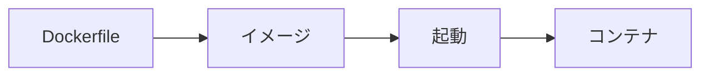

<!-- _class: title -->

# Docker の使い方

アプリと実行環境をまとめて扱い、開発と検証を再現しやすくする。

- 本文資料: `docs/fundamentals/docker.md`
- image、container、volume、network を分けて見る
- 削除と公開ポートは慎重に扱う

---

## Docker で何が楽になるか

- ランタイムのバージョンを揃えやすい
- DB や Nginx をすぐ起動できる
- ローカル環境を汚しにくい
- CI と近い環境を作りやすい

ただし、データとポートは外につながる。そこは丁寧に確認する。

---

## image と container



```text
Dockerfile -> image -> container
 設計図        雛形       実際に動くプロセス
```

- image: 実行環境を固めたもの
- container: image から起動した実体
- Dockerfile: image の作り方

まずこの 3 つを分けると Docker は見通しやすい。

---

## まず見るコマンド

```sh
docker version
docker info
docker ps
docker images
```

- Docker が動いているか
- どの container が起動中か
- どの image が手元にあるか

詰まったら、まず状態を見る。

---

## container を起動する

```sh
docker run --name web -p 8080:80 nginx:1.27
```

意味:

```text
host:8080 -> container:80
```

ブラウザで `http://localhost:8080` を開くと nginx に届く。

---

## よく使う run オプション

```sh
docker run --rm -d \
  --name app \
  -p 8080:8080 \
  -e APP_ENV=local \
  my-app:local
```

- `--rm`: 終了後に削除
- `-d`: バックグラウンド
- `-p`: ポート公開
- `-e`: 環境変数

---

## ログと中身を見る

```sh
docker logs -f web
docker exec -it web sh
docker inspect web
```

- logs: 標準出力と標準エラーを見る
- exec: 起動中 container の中でコマンドを実行
- inspect: 設定や mount、network を確認

---

## Dockerfile の基本

```Dockerfile
FROM node:22-bookworm-slim
WORKDIR /app
COPY package.json package-lock.json ./
RUN npm ci
COPY . .
CMD ["npm", "start"]
```

- `RUN`: build 時
- `CMD`: 起動時
- 変更頻度が低いものを先に書くと cache が効きやすい

---

## .dockerignore

```dockerignore
.git
node_modules
dist
.env
*.log
```

不要なファイルを build context に入れない。

`.env` やログを image build に渡さないためにも大事。

---

## Compose でまとめる

```yaml
services:
  web:
    image: nginx:1.27
    ports:
      - "8080:80"
  db:
    image: postgres:17
```

複数の container をまとめて起動できる。

---

## Compose の日常操作

```sh
docker compose up -d
docker compose ps
docker compose logs -f
docker compose down
```

- 起動
- 状態確認
- ログ確認
- 停止と削除

`down -v` は volume も消すので慎重に使う。

---

## volume はデータ置き場

```sh
docker volume ls
docker volume inspect db-data
docker volume rm db-data
```

- DB データなどを container の外に残す
- container を消しても volume は残る
- volume を消すとデータが消える

---

## network は通信のまとまり

```sh
docker network ls
docker network inspect app-net
```

同じ user-defined network の container は、名前で通信できる。

```text
postgres://user:pass@db:5432/app
```

別 container の DB に `localhost` でつなごうとしない。

---

## よくあるトラブル

- port がすでに使われている
- volume の権限が合わない
- `.dockerignore` で必要ファイルを除外している
- `localhost` の意味を取り違えている
- secret を image に入れてしまう

まず `ps`、`logs`、`inspect` を見る。

---

## まとめ

- image と container を分けて考える
- logs と exec で中を見る
- Compose は複数 container の操作に便利
- volume 削除と port 公開は慎重に確認する
- 本番では secret、tag、healthcheck、ログを必ず見る

Docker は状態を見ながら使うと怖くない。
