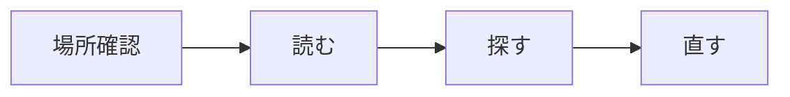

<!-- _class: title -->

# Linux コマンド

開発、調査、運用で必要な「見る・探す・直す」を安全に進める。

- 本文資料: `docs/fundamentals/linux-commands.md`
- まずは見るコマンドに慣れる
- 削除、権限変更、root 操作は慎重に扱う

---

## 最初に見るもの

```sh
pwd
whoami
hostname
date
uname -a
```

- どこで作業しているか
- 誰として実行しているか
- どの環境を見ているか

本番や共有環境では、この確認だけで事故を減らせる。

---

## 調査の流れ



いきなり変更せず、まず現在地と状態を見る。これだけで作業はかなり落ち着く。

---

## help を読む

```sh
man ls
ls --help
type ls
command -v ls
```

- `man`: 詳しい説明
- `--help`: すぐ見られる使い方
- `type`: alias や builtin も分かる

手順書では alias より正式コマンドを書く。

---

## ファイルを見る

```sh
ls -la
cat file.txt
less file.txt
head -n 20 file.txt
tail -n 100 app.log
```

まずは「変更しないで見る」操作に慣れる。

ログは `less` と `tail` を使えるだけでかなり読みやすくなる。

---

## ファイルを探す

```sh
find . -type f -name "*.log"
find . -type f -mtime -1
find . -type f -size +100M
```

- 名前で探す
- 更新日時で探す
- サイズで探す

削除と組み合わせる前に、必ず表示だけで確認する。

---

## 文字列を探す

```sh
grep -n "ERROR" app.log
grep -n -C 3 "request-id-123" app.log
rg "TODO"
```

- `-n`: 行番号
- `-C`: 前後の行
- `rg`: 使える環境なら高速で便利

ログ調査では、時刻、request id、エラー分類で絞る。

---

## コピー、移動、削除

```sh
cp source.txt dest.txt
mv old.txt new.txt
rm file.txt
rm -ri dir
```

削除は戻せないことが多い。

`rm -rf` の前には、`pwd`、`ls -la`、対象パスを確認する。

---

## 権限を見る

```sh
ls -l
id
namei -l /path/to/file
```

- ファイルの権限
- 自分の uid/gid
- パス途中のディレクトリ権限

ファイル自体が正しくても、途中のディレクトリで止まることがある。

---

## 権限を変える

```sh
chmod 644 memo.txt
chmod +x script.sh
chown user:group file.txt
```

- `chmod`: 権限を変える
- `chown`: 所有者を変える
- `-R`: 再帰変更。影響範囲が広い

`chmod -R` と `chown -R` は対象を必ず確認する。

---

## プロセスを見る

```sh
ps aux
pgrep -af nginx
top
kill -TERM <pid>
```

- 何が動いているか
- どの pid か
- CPU やメモリを使っているか
- 終了依頼を出せるか

まず `TERM`。いきなり `KILL` にしない。

---

## systemd とログ

```sh
systemctl status nginx
journalctl -u nginx -f
journalctl -u nginx --since "1 hour ago"
```

- サービス状態
- 直近ログ
- 時刻指定の調査

障害調査では、時刻とサービス名をそろえて見る。

---

## ディスクを見る

```sh
df -h
df -i
du -sh * | sort -h
find . -type f -size +100M
```

- 容量不足
- inode 不足
- 大きいディレクトリ
- 大きいファイル

いきなり消さず、まず何が大きいかを調べる。

---

## ネットワークを見る

```sh
ip addr
ip route
getent hosts example.com
curl -v https://example.com
ss -ltnp
```

- IP アドレス
- 経路
- 名前解決
- HTTP/TLS
- 待受ポート

上から順に見ると、原因を絞りやすい。

---

## shell script の基本

```bash
#!/usr/bin/env bash
set -euo pipefail

target="${1:-}"
if [ -z "$target" ]; then
  echo "usage: $0 <target>" >&2
  exit 1
fi
```

小さな確認処理から script にすると、作業が再現しやすくなる。

---

## 危険な操作

```sh
rm -rf
chmod -R
chown -R
dd
mkfs
rsync --delete
sudo
```

実行前に `pwd`、`whoami`、`echo "$TARGET"`、`ls -la "$TARGET"` を見る。

---

## まとめ

- 最初は「見る」コマンドを覚える
- 削除や権限変更は確認を増やす
- ログ調査は時刻と request id をそろえる
- 容量、プロセス、ネットワークは順番に見る
- 危険な操作は急がない

Linux コマンドは、安全に見る力が付くほど強く使える。
