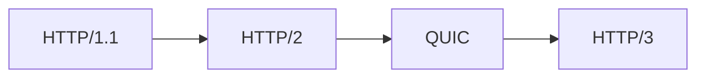

<!-- _class: title -->

# HTTP/2・HTTP/3

HTTP の進化を、接続、並列化、TLS、運用観点で整理する。

- 本文資料: `docs/network/http2-http3.md`
- 対象: HTTP/1.1 + HTTP/2 + HTTP/3
- まず全体像、次に実務の判断、最後に確認手順を押さえる
- 各章では、現場で起こりやすい状況と小さなサンプルを一緒に見る

---

## 全体像



この図を入口に、どこで何を判断するかを追っていく。

> 実務例: HTTP/2・HTTP/3の相談を受けたら、まず図のどの場所で問題が起きているかを言葉にする。

---

## HTTP/1.1

- 分かりやすいが接続あたりの並列性に制約がある。

> 実務例: HTTP/1.1では、ユーザーから「つながらない」と言われたときに、どの層で止まっているかを切り分ける。

```
Connection: keep-alive
```

---

## HTTP/2

- 1接続で多重化する。head-of-line blocking の性質が変わる。

> 実務例: HTTP/2では、ユーザーから「つながらない」と言われたときに、どの層で止まっているかを切り分ける。

```
curl --http2 -I https://example.com
```

---

## HTTP/3

- QUIC の上で動く。UDP を使う。

> 実務例: HTTP/3では、ユーザーから「つながらない」と言われたときに、どの層で止まっているかを切り分ける。

```
curl --http3 -I https://example.com
```

---

## 運用

- 対応状況、LB、WAF、ログ、監視を確認する。

> 実務例: 運用では、ユーザーから「つながらない」と言われたときに、どの層で止まっているかを切り分ける。

```
ALPN
TLS
UDP/443
```

---

## 実務で使う場面

- ユーザーからアプリまでの経路で、どこが詰まっているか切り分ける場面で使う。
- DNS、TCP、TLS、HTTP、アプリの順番で見ると、調査がぶれにくい。

- この教材では **HTTP/2・HTTP/3** を HTTP/1.1 + HTTP/2 + HTTP/3 の文脈で扱う。

---

## 判断の順番

- まず名前解決と到達性を見る。
- 次にTLSやHTTPヘッダーを確認する。
- 最後にNginxや上流アプリのログへ進む。

---

## サンプル確認

手元では、小さく動かして結果を見るところから始める。

```sh
getent hosts example.com
curl -vkI https://example.com
ss -ltnp
```

---

## よくある失敗

- アプリだけを疑ってDNSやTLSを見ない
- コンテナ内のlocalhostを誤解する
- LBのhealthcheckと実リクエストの差を見落とす

---

## チェックリスト

- dig/getentで名前解決を見る
- curl -vでTLSとHTTPを見る
- access logとupstreamのstatusを見る

---

## ミニ演習

- curl -vの出力からDNS/TLS/HTTPを分ける
- Nginxの設定テストとreloadを試す
- 障害調査メモを時系列で書く

---

## まとめ

- 目的と境界を先に決める
- 状態を確認してから変更する
- 具体例で動かし、ログや結果で確かめる
- 危険な操作は影響範囲を確認する
