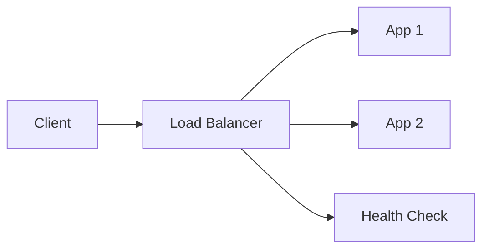

<!-- _class: title -->

# Load Balancing

複数サーバーへ安全に流量を分け、障害時にもサービスを続ける。

- 本文資料: `docs/network/load-balancing.md`
- 対象: LB + upstreams + healthcheck
- まず全体像、次に実務の判断、最後に確認手順を押さえる
- 各章では、現場で起こりやすい状況と小さなサンプルを一緒に見る

---

## 全体像



この図を入口に、どこで何を判断するかを追っていく。

> 実務例: Load Balancingの相談を受けたら、まず図のどの場所で問題が起きているかを言葉にする。

---

## 目的

- 負荷分散、冗長化、メンテナンス切り替え。

> 実務例: 目的では、ユーザーから「つながらない」と言われたときに、どの層で止まっているかを切り分ける。

```
round robin
least connections
```

---

## healthcheck

- 落ちた upstream に流さない。

> 実務例: healthcheckでは、ユーザーから「つながらない」と言われたときに、どの層で止まっているかを切り分ける。

```
/health
200 OK
```

---

## session

- sticky が必要か、stateless にできるか考える。

> 実務例: sessionでは、ユーザーから「つながらない」と言われたときに、どの層で止まっているかを切り分ける。

```
cookie
JWT
server-side session
```

---

## 観測

- 5xx、latency、upstream別エラーを見る。

> 実務例: 観測では、ユーザーから「つながらない」と言われたときに、どの層で止まっているかを切り分ける。

```
upstream_status
request_time
```

---

## 実務で使う場面

- ユーザーからアプリまでの経路で、どこが詰まっているか切り分ける場面で使う。
- DNS、TCP、TLS、HTTP、アプリの順番で見ると、調査がぶれにくい。

- この教材では **Load Balancing** を LB + upstreams + healthcheck の文脈で扱う。

---

## 判断の順番

- まず名前解決と到達性を見る。
- 次にTLSやHTTPヘッダーを確認する。
- 最後にNginxや上流アプリのログへ進む。

---

## サンプル確認

手元では、小さく動かして結果を見るところから始める。

```sh
getent hosts example.com
curl -vkI https://example.com
ss -ltnp
```

---

## よくある失敗

- アプリだけを疑ってDNSやTLSを見ない
- コンテナ内のlocalhostを誤解する
- LBのhealthcheckと実リクエストの差を見落とす

---

## チェックリスト

- dig/getentで名前解決を見る
- curl -vでTLSとHTTPを見る
- access logとupstreamのstatusを見る

---

## ミニ演習

- curl -vの出力からDNS/TLS/HTTPを分ける
- Nginxの設定テストとreloadを試す
- 障害調査メモを時系列で書く

---

## まとめ

- 目的と境界を先に決める
- 状態を確認してから変更する
- 具体例で動かし、ログや結果で確かめる
- 危険な操作は影響範囲を確認する
