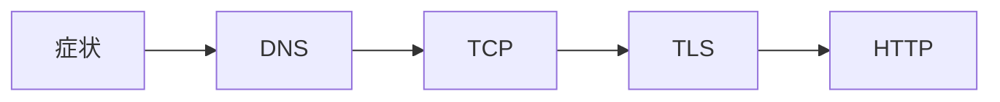

<!-- _class: title -->

# Network Troubleshooting

疎通、名前解決、TLS、HTTP、アプリの順に切り分ける。

- 本文資料: `docs/network/network-troubleshooting.md`
- 対象: Linux network tools
- まず全体像、次に実務の判断、最後に確認手順を押さえる
- 各章では、現場で起こりやすい状況と小さなサンプルを一緒に見る

---

## 全体像



この図を入口に、どこで何を判断するかを追っていく。

> 実務例: Network Troubleshootingの相談を受けたら、まず図のどの場所で問題が起きているかを言葉にする。

---

## 順番

- いきなりアプリを疑わない。下の層から見る。

> 実務例: 順番では、ユーザーから「つながらない」と言われたときに、どの層で止まっているかを切り分ける。

```
ip addr
ip route
getent hosts
```

---

## TCP

- port が開いているか見る。

> 実務例: TCPでは、ユーザーから「つながらない」と言われたときに、どの層で止まっているかを切り分ける。

```
ss -ltnp
nc -vz example.com 443
```

---

## HTTP

- status、header、redirect、body を見る。

> 実務例: HTTPでは、ユーザーから「つながらない」と言われたときに、どの層で止まっているかを切り分ける。

```
curl -v -I https://example.com
```

---

## 記録

- 時刻、対象、結果をメモする。

> 実務例: 記録では、ユーザーから「つながらない」と言われたときに、どの層で止まっているかを切り分ける。

```
when
target
command
result
```

---

## 実務で使う場面

- ユーザーからアプリまでの経路で、どこが詰まっているか切り分ける場面で使う。
- DNS、TCP、TLS、HTTP、アプリの順番で見ると、調査がぶれにくい。

- この教材では **Network Troubleshooting** を Linux network tools の文脈で扱う。

---

## 判断の順番

- まず名前解決と到達性を見る。
- 次にTLSやHTTPヘッダーを確認する。
- 最後にNginxや上流アプリのログへ進む。

---

## サンプル確認

手元では、小さく動かして結果を見るところから始める。

```sh
getent hosts example.com
curl -vkI https://example.com
ss -ltnp
```

---

## よくある失敗

- アプリだけを疑ってDNSやTLSを見ない
- コンテナ内のlocalhostを誤解する
- LBのhealthcheckと実リクエストの差を見落とす

---

## チェックリスト

- dig/getentで名前解決を見る
- curl -vでTLSとHTTPを見る
- access logとupstreamのstatusを見る

---

## ミニ演習

- curl -vの出力からDNS/TLS/HTTPを分ける
- Nginxの設定テストとreloadを試す
- 障害調査メモを時系列で書く

---

## まとめ

- 目的と境界を先に決める
- 状態を確認してから変更する
- 具体例で動かし、ログや結果で確かめる
- 危険な操作は影響範囲を確認する
