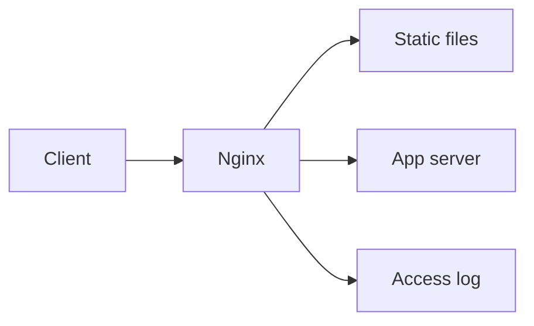

<!-- _class: title -->

# Nginx

静的配信、reverse proxy、TLS、ログ、負荷対策を整理する。

- 本文資料: `docs/network/nginx.md`
- 対象: Nginx + upstream app
- まず全体像、次に実務の判断、最後に確認手順を押さえる
- 各章では、現場で起こりやすい状況と小さなサンプルを一緒に見る

---

## 全体像



この図を入口に、どこで何を判断するかを追っていく。

> 実務例: Nginxの相談を受けたら、まず図のどの場所で問題が起きているかを言葉にする。

---

## server block

- host、port、root、proxy を分けて読む。

> 実務例: server blockでは、ユーザーから「つながらない」と言われたときに、どの層で止まっているかを切り分ける。

```
server {
  listen 80;
  server_name example.com;
}
```

---

## reverse proxy

- 上流アプリへリクエストを渡す。

> 実務例: reverse proxyでは、ユーザーから「つながらない」と言われたときに、どの層で止まっているかを切り分ける。

```
location /api/ {
  proxy_pass http://app:3000/;
}
```

---

## ログ

- access log と error log を調査に使う。

> 実務例: ログでは、ユーザーから「つながらない」と言われたときに、どの層で止まっているかを切り分ける。

```
access_log /var/log/nginx/access.log;
error_log /var/log/nginx/error.log warn;
```

---

## 確認

- 設定テスト、reload、疎通を順に実行する。

> 実務例: 確認では、ユーザーから「つながらない」と言われたときに、どの層で止まっているかを切り分ける。

```
nginx -t
systemctl reload nginx
curl -I http://localhost
```

---

## 実務で使う場面

- ユーザーからアプリまでの経路で、どこが詰まっているか切り分ける場面で使う。
- DNS、TCP、TLS、HTTP、アプリの順番で見ると、調査がぶれにくい。

- この教材では **Nginx** を Nginx + upstream app の文脈で扱う。

---

## 判断の順番

- まず名前解決と到達性を見る。
- 次にTLSやHTTPヘッダーを確認する。
- 最後にNginxや上流アプリのログへ進む。

---

## サンプル確認

手元では、小さく動かして結果を見るところから始める。

```sh
getent hosts example.com
curl -vkI https://example.com
ss -ltnp
```

---

## よくある失敗

- アプリだけを疑ってDNSやTLSを見ない
- コンテナ内のlocalhostを誤解する
- LBのhealthcheckと実リクエストの差を見落とす

---

## チェックリスト

- dig/getentで名前解決を見る
- curl -vでTLSとHTTPを見る
- access logとupstreamのstatusを見る

---

## ミニ演習

- curl -vの出力からDNS/TLS/HTTPを分ける
- Nginxの設定テストとreloadを試す
- 障害調査メモを時系列で書く

---

## まとめ

- 目的と境界を先に決める
- 状態を確認してから変更する
- 具体例で動かし、ログや結果で確かめる
- 危険な操作は影響範囲を確認する
