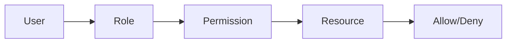

<!-- _class: title -->

# 認可設計

ロール、権限、所有者、状態によるアクセス制御を整理する。

- 本文資料: `docs/security/authz-design.md`
- 対象: RBAC + resource policy
- まず全体像、次に実務の判断、最後に確認手順を押さえる
- 各章では、現場で起こりやすい状況と小さなサンプルを一緒に見る

---

## 全体像



この図を入口に、どこで何を判断するかを追っていく。

> 実務例: 認可設計の相談を受けたら、まず図のどの場所で問題が起きているかを言葉にする。

---

## 認可の単位

- 画面ではなく操作で考える。
- 一覧、詳細、作成、更新、削除を分ける。

> 実務例: 認可の単位では、未ログイン・権限不足・許可済みを分けて確認し、想定外のアクセスを防ぐ。

```
order:read
order:update
order:cancel
```

---

## 所有者条件

- 自分のデータだけ許可する場合は resource owner を確認する。

> 実務例: 所有者条件では、未ログイン・権限不足・許可済みを分けて確認し、想定外のアクセスを防ぐ。

```
order.userId == currentUser.id
```

---

## deny by default

- 明示的に許可したものだけ通す。

> 実務例: deny by defaultでは、未ログイン・権限不足・許可済みを分けて確認し、想定外のアクセスを防ぐ。

```
if (!allowed) throw new AccessDeniedException();
```

---

## 監査

- 誰が、いつ、何に、なぜアクセスしたかを残す。

> 実務例: 監査では、未ログイン・権限不足・許可済みを分けて確認し、想定外のアクセスを防ぐ。

```
userId
resourceId
action
result
```

---

## 実務で使う場面

- ログイン、権限、ブラウザ制約、secret、事故対応を安全に設計する場面で使う。
- 便利さよりも、漏れたとき・間違えたときの被害を小さくする考え方が大切。

- この教材では **認可設計** を RBAC + resource policy の文脈で扱う。

---

## 判断の順番

- 認証は誰か、認可は何を許すかとして分ける。
- 明示的に許可したものだけ通す。
- secretは作成、保管、注入、更新、廃棄まで一連で考える。

---

## サンプル確認

手元では、小さく動かして結果を見るところから始める。

```sh
curl -i http://localhost:8080/admin
curl -i -H 'Authorization: Bearer <token>' http://localhost:8080/admin
```

---

## よくある失敗

- CORSを認可の代わりに使う
- 管理者ロールだけで細かい操作を全部許す
- 漏えい後にtokenを無効化せず履歴修正だけする

---

## チェックリスト

- 未ログイン、権限不足、許可済みの3パターンを確認する
- Cookieやtokenの属性を確認する
- ログとリポジトリにsecretがないか確認する

---

## ミニ演習

- deny by defaultの設定を作る
- 権限不足のテストを書く
- 漏えい時の初動メモを作る

---

## まとめ

- 目的と境界を先に決める
- 状態を確認してから変更する
- 具体例で動かし、ログや結果で確かめる
- 危険な操作は影響範囲を確認する
