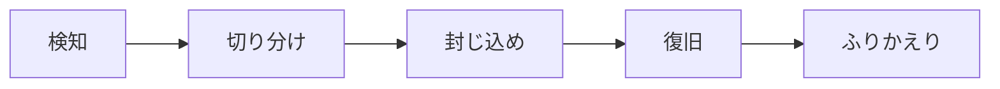

<!-- _class: title -->

# Incident Response

検知から封じ込め、復旧、ふりかえりまでを落ち着いて進める。

- 本文資料: `docs/security/incident-response.md`
- 対象: logs + runbook + communication
- まず全体像、次に実務の判断、最後に確認手順を押さえる
- 各章では、現場で起こりやすい状況と小さなサンプルを一緒に見る

---

## 全体像



この図を入口に、どこで何を判断するかを追っていく。

> 実務例: Incident Responseの相談を受けたら、まず図のどの場所で問題が起きているかを言葉にする。

---

## 初動

- 時刻、影響、証拠、連絡先を整理する。

> 実務例: 初動では、未ログイン・権限不足・許可済みを分けて確認し、想定外のアクセスを防ぐ。

```
when
what
scope
owner
```

---

## 封じ込め

- 影響拡大を止める。証拠を消さない。

> 実務例: 封じ込めでは、未ログイン・権限不足・許可済みを分けて確認し、想定外のアクセスを防ぐ。

```
disable token
block traffic
snapshot logs
```

---

## 復旧

- 原因が残ったまま戻さない。監視を強める。

> 実務例: 復旧では、未ログイン・権限不足・許可済みを分けて確認し、想定外のアクセスを防ぐ。

```
rollback
patch
verify
```

---

## ふりかえり

- 責めずに仕組みを直す。

> 実務例: ふりかえりでは、未ログイン・権限不足・許可済みを分けて確認し、想定外のアクセスを防ぐ。

```
timeline
root cause
action items
```

---

## 実務で使う場面

- ログイン、権限、ブラウザ制約、secret、事故対応を安全に設計する場面で使う。
- 便利さよりも、漏れたとき・間違えたときの被害を小さくする考え方が大切。

- この教材では **Incident Response** を logs + runbook + communication の文脈で扱う。

---

## 判断の順番

- 認証は誰か、認可は何を許すかとして分ける。
- 明示的に許可したものだけ通す。
- secretは作成、保管、注入、更新、廃棄まで一連で考える。

---

## サンプル確認

手元では、小さく動かして結果を見るところから始める。

```sh
curl -i http://localhost:8080/admin
curl -i -H 'Authorization: Bearer <token>' http://localhost:8080/admin
```

---

## よくある失敗

- CORSを認可の代わりに使う
- 管理者ロールだけで細かい操作を全部許す
- 漏えい後にtokenを無効化せず履歴修正だけする

---

## チェックリスト

- 未ログイン、権限不足、許可済みの3パターンを確認する
- Cookieやtokenの属性を確認する
- ログとリポジトリにsecretがないか確認する

---

## ミニ演習

- deny by defaultの設定を作る
- 権限不足のテストを書く
- 漏えい時の初動メモを作る

---

## まとめ

- 目的と境界を先に決める
- 状態を確認してから変更する
- 具体例で動かし、ログや結果で確かめる
- 危険な操作は影響範囲を確認する
