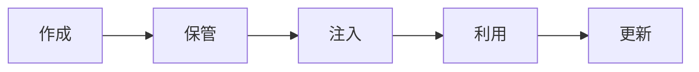

<!-- _class: title -->

# Secret 管理

秘密情報を作る、渡す、使う、捨てるまでを安全に扱う。

- 本文資料: `docs/security/secret-management.md`
- 対象: env vars + secret manager
- まず全体像、次に実務の判断、最後に確認手順を押さえる
- 各章では、現場で起こりやすい状況と小さなサンプルを一緒に見る

---

## 全体像



この図を入口に、どこで何を判断するかを追っていく。

> 実務例: Secret 管理の相談を受けたら、まず図のどの場所で問題が起きているかを言葉にする。

---

## secret の例

- API token、DB password、署名鍵、Cookie secret。

> 実務例: secret の例では、未ログイン・権限不足・許可済みを分けて確認し、想定外のアクセスを防ぐ。

```
DATABASE_PASSWORD
JWT_SIGNING_KEY
```

---

## 置かない場所

- Git、Docker image、ログ、チケット本文に置かない。

> 実務例: 置かない場所では、未ログイン・権限不足・許可済みを分けて確認し、想定外のアクセスを防ぐ。

```
.env
application.yml
Dockerfile
```

---

## 渡し方

- 実行環境の secret store や環境変数から渡す。

> 実務例: 渡し方では、未ログイン・権限不足・許可済みを分けて確認し、想定外のアクセスを防ぐ。

```
export DATABASE_URL=...
```

---

## 漏れたら

- 無効化、再発行、影響確認、履歴確認の順に動く。

> 実務例: 漏れたらでは、未ログイン・権限不足・許可済みを分けて確認し、想定外のアクセスを防ぐ。

```
rotate
audit
notify
```

---

## 実務で使う場面

- ログイン、権限、ブラウザ制約、secret、事故対応を安全に設計する場面で使う。
- 便利さよりも、漏れたとき・間違えたときの被害を小さくする考え方が大切。

- この教材では **Secret 管理** を env vars + secret manager の文脈で扱う。

---

## 判断の順番

- 認証は誰か、認可は何を許すかとして分ける。
- 明示的に許可したものだけ通す。
- secretは作成、保管、注入、更新、廃棄まで一連で考える。

---

## サンプル確認

手元では、小さく動かして結果を見るところから始める。

```sh
curl -i http://localhost:8080/admin
curl -i -H 'Authorization: Bearer <token>' http://localhost:8080/admin
```

---

## よくある失敗

- CORSを認可の代わりに使う
- 管理者ロールだけで細かい操作を全部許す
- 漏えい後にtokenを無効化せず履歴修正だけする

---

## チェックリスト

- 未ログイン、権限不足、許可済みの3パターンを確認する
- Cookieやtokenの属性を確認する
- ログとリポジトリにsecretがないか確認する

---

## ミニ演習

- deny by defaultの設定を作る
- 権限不足のテストを書く
- 漏えい時の初動メモを作る

---

## まとめ

- 目的と境界を先に決める
- 状態を確認してから変更する
- 具体例で動かし、ログや結果で確かめる
- 危険な操作は影響範囲を確認する
