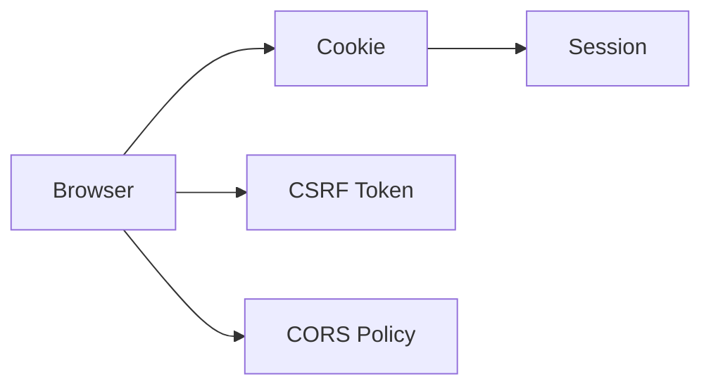

<!-- _class: title -->

# Session/CSRF/CORS

ブラウザの認証状態、CSRF、CORS を混同せずに整理する。

- 本文資料: `docs/security/session-csrf-cors.md`
- 対象: Browser + Spring Security
- まず全体像、次に実務の判断、最後に確認手順を押さえる
- 各章では、現場で起こりやすい状況と小さなサンプルを一緒に見る

---

## 全体像



この図を入口に、どこで何を判断するかを追っていく。

> 実務例: Session/CSRF/CORSの相談を受けたら、まず図のどの場所で問題が起きているかを言葉にする。

---

## Session

- Cookie に session id を持たせ、サーバー側で状態を持つ。

> 実務例: Sessionでは、未ログイン・権限不足・許可済みを分けて確認し、想定外のアクセスを防ぐ。

```
Set-Cookie: SESSION=...; HttpOnly; Secure; SameSite=Lax
```

---

## CSRF

- ログイン済みブラウザから意図しないリクエストを送らせる攻撃を防ぐ。

> 実務例: CSRFでは、未ログイン・権限不足・許可済みを分けて確認し、想定外のアクセスを防ぐ。

```
<input type="hidden" name="_csrf" value="...">
```

---

## CORS

- ブラウザが別 origin への読み取りを制御する仕組み。

> 実務例: CORSでは、未ログイン・権限不足・許可済みを分けて確認し、想定外のアクセスを防ぐ。

```
Access-Control-Allow-Origin: https://app.example.com
```

---

## 設計

- Cookie 認証なら CSRF を考える。API token なら保管場所を考える。

> 実務例: 設計では、未ログイン・権限不足・許可済みを分けて確認し、想定外のアクセスを防ぐ。

```
SameSite
HttpOnly
Secure
```

---

## 実務で使う場面

- ログイン、権限、ブラウザ制約、secret、事故対応を安全に設計する場面で使う。
- 便利さよりも、漏れたとき・間違えたときの被害を小さくする考え方が大切。

- この教材では **Session/CSRF/CORS** を Browser + Spring Security の文脈で扱う。

---

## 判断の順番

- 認証は誰か、認可は何を許すかとして分ける。
- 明示的に許可したものだけ通す。
- secretは作成、保管、注入、更新、廃棄まで一連で考える。

---

## サンプル確認

手元では、小さく動かして結果を見るところから始める。

```sh
curl -i http://localhost:8080/admin
curl -i -H 'Authorization: Bearer <token>' http://localhost:8080/admin
```

---

## よくある失敗

- CORSを認可の代わりに使う
- 管理者ロールだけで細かい操作を全部許す
- 漏えい後にtokenを無効化せず履歴修正だけする

---

## チェックリスト

- 未ログイン、権限不足、許可済みの3パターンを確認する
- Cookieやtokenの属性を確認する
- ログとリポジトリにsecretがないか確認する

---

## ミニ演習

- deny by defaultの設定を作る
- 権限不足のテストを書く
- 漏えい時の初動メモを作る

---

## まとめ

- 目的と境界を先に決める
- 状態を確認してから変更する
- 具体例で動かし、ログや結果で確かめる
- 危険な操作は影響範囲を確認する
