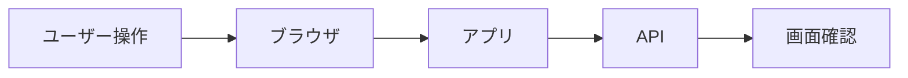

<!-- _class: title -->

# E2E テスト

ユーザー操作に近い形で、公開後に壊れて困る導線を確認する。

- 本文資料: `docs/web/e2e-testing.md`
- 対象: Playwright + Nuxt/Spring
- まず全体像、次に実務の判断、最後に確認手順を押さえる
- 各章では、現場で起こりやすい状況と小さなサンプルを一緒に見る

---

## 全体像



この図を入口に、どこで何を判断するかを追っていく。

> 実務例: E2E テストの相談を受けたら、まず図のどの場所で問題が起きているかを言葉にする。

---

## E2E の役割

- 画面、ルーティング、API、認証、配信設定がつながっているかを見る。
- 単体テストの代わりではなく、重要導線の最後の確認。

> 実務例: ログインから登録完了まで、ユーザーが本当に通る画面遷移をブラウザで確認する。

```
login
create order
checkout
admin permission
```

---

## 最初に守る導線

- ログイン、検索、登録、編集、削除、権限エラーなどを優先する。
- ユーザーが毎日使う画面から選ぶ。

> 実務例: 売上や問い合わせに直結する作成、検索、決済の導線から自動化する。

```
test('ユーザーを作成できる', async ({ page }) => {
  await page.goto('/users/new');
});
```

---

## locator

- CSSの細かい構造より、roleやlabelで探す。
- 画面の意味に近いlocatorは壊れにくい。

> 実務例: ボタン文言や入力ラベルで探すと、CSSクラス変更だけでは壊れにくい。

```
await page.getByRole('button', { name: '保存' }).click();
await page.getByLabel('メール').fill('aki@example.com');
```

---

## 待ち方

- 固定sleepではなく、画面の状態を待つ。
- 表示、URL、レスポンス、API完了など目的で待つ。

> 実務例: 保存後のトースト表示やURL変更を待ち、固定sleepで偶然通るテストを避ける。

```
await expect(page.getByText('保存しました')).toBeVisible();
await expect(page).toHaveURL(/\/users$/);
```

---

## テストデータ

- テストごとに独立したデータを用意する。
- 既存データに依存すると順番や環境で壊れやすい。

> 実務例: メールアドレスに時刻やUUIDを入れて、並列実行でもぶつからないようにする。

```
const email = `user-${Date.now()}@example.com`;
```

---

## 認証

- UIログインを毎回通すと重くなる。
- storageStateなどでログイン済み状態を使い回す。

> 実務例: 毎回ログイン画面を通さず、ログイン済み状態を保存して重要導線に時間を使う。

```
use: { storageState: 'playwright/.auth/user.json' }
```

---

## スクリーンショット

- 失敗時の画面を残すと調査が速い。
- レイアウト崩れは画像で確認すると見落としにくい。

> 実務例: 失敗時の画面をartifactに残し、CSS崩れやエラーメッセージをすぐ確認する。

```
npx playwright test --trace on
npx playwright screenshot http://localhost:3000 screenshot.png
```

---

## CI

- ブラウザ依存をCIに入れる。
- baseURL、起動待ち、artifact保存を設定する。

> 実務例: GitHub Actionsでアプリを起動し、Chromiumでスモークテストを走らせる。

```
webServer: { command: 'pnpm dev', url: 'http://127.0.0.1:3000' }
```

---

## 壊れやすさ対策

- 何でもE2Eにしない。
- 導線を絞り、詳細な分岐は単体や結合テストへ寄せる。

> 実務例: 入力バリデーションの細かい分岐はJUnitへ寄せ、E2Eは代表導線に絞る。

```
unit: validation
integration: API status
e2e: happy path + critical error
```

---

## リリース確認

- 本番相当URLでスモーク確認する。
- 確認したURLと結果をリリースメモに残す。

> 実務例: Pagesや本番URLでスクリーンショットを撮り、配信後の画面崩れを確認する。

```
npx playwright test --project=chromium
npx playwright screenshot https://example.com/ page.png
```

---

## 実務で使う場面

- 画面や外部クライアントから来たリクエストを、安全にアプリの処理へ渡す場面で使う。
- APIの境界、入力検証、例外、設定、テストをそろえると変更に強くなる。

- この教材では **E2E テスト** を Playwright + Nuxt/Spring の文脈で扱う。

---

## 判断の順番

- HTTPの責務と業務ロジックの責務を分ける。
- 外部公開のDTOと内部モデルを混ぜない。
- 正常系だけでなく、入力エラーと失敗時の応答を先に決める。

---

## サンプル確認

手元では、小さく動かして結果を見るところから始める。

```sh
curl -i -X POST http://localhost:8080/api/users \
  -H 'Content-Type: application/json' \
  -d '{"name":"Aki","email":"aki@example.com"}'
```

---

## よくある失敗

- Controllerに業務判断を詰め込みすぎる
- 入力エラーを全部500で返す
- secretや個人情報をログに出す

---

## チェックリスト

- Controller/APIの入出力をテストする
- ログにrequest idなどの追跡情報を入れる
- 設定値とsecretの出どころを確認する

---

## ミニ演習

- 小さなPOST APIを作る
- 未入力、形式不正、重複のテストを書く
- curlでstatusとbodyを確認する

---

## まとめ

- 目的と境界を先に決める
- 状態を確認してから変更する
- 具体例で動かし、ログや結果で確かめる
- 危険な操作は影響範囲を確認する
