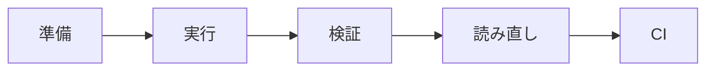

<!-- _class: title -->

# JUnit 入門と実務

Javaの単体テストを、読みやすく壊れにくい形で書けるようにする。

- 本文資料: `docs/web/junit.md`
- 対象: Java + JUnit 5 + AssertJ + Mockito
- まず全体像、次に実務の判断、最後に確認手順を押さえる
- 各章では、現場で起こりやすい状況と小さなサンプルを一緒に見る

---

## 全体像



この図を入口に、どこで何を判断するかを追っていく。

> 実務例: JUnit 入門と実務の相談を受けたら、まず図のどの場所で問題が起きているかを言葉にする。

---

## JUnit の位置づけ

- 業務ロジックを速く、細かく、何度でも確認するための道具。
- UIやDBを全部通す前に、判断の分岐を小さく守る。

> 実務例: 料金計算や在庫判定のように、画面がなくても結果を確認できるロジックを素早く守る。

```
mvn test
gradle test
```

---

## AAAで書く

- Arrangeで準備、Actで実行、Assertで期待結果を見る。
- 1つのテストで見たいことを欲張りすぎない。

> 実務例: 注文データを準備し、合計金額を計算し、期待金額と一致するかを見る。

```
// Arrange
Order order = new Order(1000);
// Act
int total = service.total(order);
// Assert
assertThat(total).isEqualTo(1000);
```

---

## テスト名

- 何をしたら、どうなるかを名前にする。
- 日本語名でも、英語名でも、読む人が意図を追えることを優先する。

> 実務例: 失敗したCIログだけを読んでも、どの仕様が壊れたか分かる名前にする。

```
@Test
void 在庫が足りない場合は注文できない() {
  // ...
}
```

---

## AssertJ

- 失敗時に読みやすいassertを書く。
- 値、コレクション、例外を自然な形で検証する。

> 実務例: ユーザー一覧に期待したメールアドレスが含まれるか、読みやすいassertで確認する。

```
assertThat(users).extracting(User::email)
  .contains("aki@example.com");
```

---

## 例外テスト

- 例外が出ることだけでなく、メッセージや理由も必要に応じて見る。

> 実務例: キャンセル済み注文を再キャンセルしたとき、業務例外になることを確認する。

```
assertThatThrownBy(() -> service.cancel(orderId))
  .isInstanceOf(IllegalStateException.class)
```

---

## ParameterizedTest

- 似た入力の境界値をまとめて確認する。
- テーブル形式にすると、仕様として読みやすくなる。

> 実務例: 数量0、1、上限値などの境界値を表でまとめて確認する。

```
@ParameterizedTest
@CsvSource({"0,false", "1,true", "10,true"})
void quantityを検証する(int quantity, boolean expected) { }
```

---

## Mockito

- 外部依存を置き換えて、serviceの判断だけをテストする。
- mockしすぎると実装詳細に弱くなるので注意する。

> 実務例: メール送信や外部APIをmockにして、サービスの判断だけを見る。

```
when(userRepository.existsByEmail(email)).thenReturn(true);
verify(mailSender).send(any());
```

---

## Spring の単体寄りテスト

- 全部のApplicationContextを起動しないテストを選ぶ。
- Controller境界はMockMvc、純粋なロジックは普通のJUnitで十分。

> 実務例: ControllerのHTTP応答だけをMockMvcで確認し、DB起動を待たない。

```
@WebMvcTest(UserController.class)
@MockBean UserService userService
```

---

## 失敗しにくいテスト

- 時刻、乱数、外部API、並び順は固定する。
- テストが落ちたとき、何が壊れたか分かるassertにする。

> 実務例: 現在時刻に依存する処理は固定Clockを渡して、日付で落ちないようにする。

```
Clock fixedClock = Clock.fixed(instant, ZoneOffset.UTC);
```

---

## CIでの扱い

- 速いテストは毎回走らせる。
- 重いテストは分けてもよいが、リリース前には必ず通す。

> 実務例: PRごとに速いJUnitを回し、失敗したらリリース前に原因を直す。

```
mvn test
mvn -Dtest=UserServiceTest test
```

---

## 実務で使う場面

- 画面や外部クライアントから来たリクエストを、安全にアプリの処理へ渡す場面で使う。
- APIの境界、入力検証、例外、設定、テストをそろえると変更に強くなる。

- この教材では **JUnit 入門と実務** を Java + JUnit 5 + AssertJ + Mockito の文脈で扱う。

---

## 判断の順番

- HTTPの責務と業務ロジックの責務を分ける。
- 外部公開のDTOと内部モデルを混ぜない。
- 正常系だけでなく、入力エラーと失敗時の応答を先に決める。

---

## サンプル確認

手元では、小さく動かして結果を見るところから始める。

```sh
curl -i -X POST http://localhost:8080/api/users \
  -H 'Content-Type: application/json' \
  -d '{"name":"Aki","email":"aki@example.com"}'
```

---

## よくある失敗

- Controllerに業務判断を詰め込みすぎる
- 入力エラーを全部500で返す
- secretや個人情報をログに出す

---

## チェックリスト

- Controller/APIの入出力をテストする
- ログにrequest idなどの追跡情報を入れる
- 設定値とsecretの出どころを確認する

---

## ミニ演習

- 小さなPOST APIを作る
- 未入力、形式不正、重複のテストを書く
- curlでstatusとbodyを確認する

---

## まとめ

- 目的と境界を先に決める
- 状態を確認してから変更する
- 具体例で動かし、ログや結果で確かめる
- 危険な操作は影響範囲を確認する
