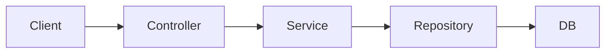

<!-- _class: title -->

# Spring MVC/API

HTTP と Spring MVC をつなげ、API の境界、責務、エラー設計を整理する。

- 本文資料: `docs/web/spring-mvc-api.md`
- 対象: Linux + Nginx + Java/Spring + MySQL
- まず全体像、次に実務の判断、最後に確認手順を押さえる
- 各章では、現場で起こりやすい状況と小さなサンプルを一緒に見る

---

## 全体像



この図を入口に、どこで何を判断するかを追っていく。

> 実務例: Spring MVC/APIの相談を受けたら、まず図のどの場所で問題が起きているかを言葉にする。

---

## API の責務

- Controller は入力とHTTP境界を担当する。
- 業務判断は Service に寄せる。

> 実務例: API の責務では、画面やAPIの入力が壊れたときに、どこで受け止めてどう返すかを決める。

```
@RestController
@RequestMapping("/api/users")
```

---

## DTO

- 外部公開の形と内部モデルを分ける。

> 実務例: DTOでは、画面やAPIの入力が壊れたときに、どこで受け止めてどう返すかを決める。

```
record CreateUserRequest(String name, String email) {}
record UserResponse(long id, String name) {}
```

---

## エラー

- 業務エラー、入力エラー、システムエラーを分ける。

> 実務例: エラーでは、画面やAPIの入力が壊れたときに、どこで受け止めてどう返すかを決める。

```
@ExceptionHandler(MethodArgumentNotValidException.class)
return ResponseEntity.badRequest().body(problem);
```

---

## 境界テスト

- Controller はHTTP入出力を確認する。

> 実務例: 境界テストでは、画面やAPIの入力が壊れたときに、どこで受け止めてどう返すかを決める。

```
mockMvc.perform(post("/api/users"))
  .andExpect(status().isCreated());
```

---

## 実務で使う場面

- 画面や外部クライアントから来たリクエストを、安全にアプリの処理へ渡す場面で使う。
- APIの境界、入力検証、例外、設定、テストをそろえると変更に強くなる。

- この教材では **Spring MVC/API** を Linux + Nginx + Java/Spring + MySQL の文脈で扱う。

---

## 判断の順番

- HTTPの責務と業務ロジックの責務を分ける。
- 外部公開のDTOと内部モデルを混ぜない。
- 正常系だけでなく、入力エラーと失敗時の応答を先に決める。

---

## サンプル確認

手元では、小さく動かして結果を見るところから始める。

```sh
curl -i -X POST http://localhost:8080/api/users \
  -H 'Content-Type: application/json' \
  -d '{"name":"Aki","email":"aki@example.com"}'
```

---

## よくある失敗

- Controllerに業務判断を詰め込みすぎる
- 入力エラーを全部500で返す
- secretや個人情報をログに出す

---

## チェックリスト

- Controller/APIの入出力をテストする
- ログにrequest idなどの追跡情報を入れる
- 設定値とsecretの出どころを確認する

---

## ミニ演習

- 小さなPOST APIを作る
- 未入力、形式不正、重複のテストを書く
- curlでstatusとbodyを確認する

---

## まとめ

- 目的と境界を先に決める
- 状態を確認してから変更する
- 具体例で動かし、ログや結果で確かめる
- 危険な操作は影響範囲を確認する
