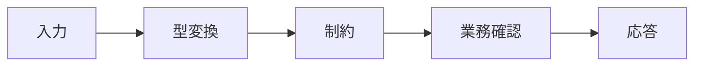

<!-- _class: title -->

# Spring Validation

入力検証を、型、制約、業務ルール、表示メッセージに分けて扱う。

- 本文資料: `docs/web/spring-validation.md`
- 対象: Spring Boot + Bean Validation
- まず全体像、次に実務の判断、最後に確認手順を押さえる
- 各章では、現場で起こりやすい状況と小さなサンプルを一緒に見る

---

## 全体像



この図を入口に、どこで何を判断するかを追っていく。

> 実務例: Spring Validationの相談を受けたら、まず図のどの場所で問題が起きているかを言葉にする。

---

## 検証の層

- 形式チェックと業務チェックを混ぜない。

> 実務例: 検証の層では、画面やAPIの入力が壊れたときに、どこで受け止めてどう返すかを決める。

```
@NotBlank
@Email
@Size(max = 100)
```

---

## DTO に書く

- 外部入力に近い場所へ制約を書く。

> 実務例: DTO に書くでは、画面やAPIの入力が壊れたときに、どこで受け止めてどう返すかを決める。

```
record SignupRequest(@Email String email, @NotBlank String name) {}
```

---

## メッセージ

- ユーザーに何を直せばよいか伝える。

> 実務例: メッセージでは、画面やAPIの入力が壊れたときに、どこで受け止めてどう返すかを決める。

```
email: メールアドレスの形式で入力してください
```

---

## テスト

- 正常系、境界値、未入力を確認する。

> 実務例: テストでは、画面やAPIの入力が壊れたときに、どこで受け止めてどう返すかを決める。

```
null
""
"a@example.com"
```

---

## 実務で使う場面

- 画面や外部クライアントから来たリクエストを、安全にアプリの処理へ渡す場面で使う。
- APIの境界、入力検証、例外、設定、テストをそろえると変更に強くなる。

- この教材では **Spring Validation** を Spring Boot + Bean Validation の文脈で扱う。

---

## 判断の順番

- HTTPの責務と業務ロジックの責務を分ける。
- 外部公開のDTOと内部モデルを混ぜない。
- 正常系だけでなく、入力エラーと失敗時の応答を先に決める。

---

## サンプル確認

手元では、小さく動かして結果を見るところから始める。

```sh
curl -i -X POST http://localhost:8080/api/users \
  -H 'Content-Type: application/json' \
  -d '{"name":"Aki","email":"aki@example.com"}'
```

---

## よくある失敗

- Controllerに業務判断を詰め込みすぎる
- 入力エラーを全部500で返す
- secretや個人情報をログに出す

---

## チェックリスト

- Controller/APIの入出力をテストする
- ログにrequest idなどの追跡情報を入れる
- 設定値とsecretの出どころを確認する

---

## ミニ演習

- 小さなPOST APIを作る
- 未入力、形式不正、重複のテストを書く
- curlでstatusとbodyを確認する

---

## まとめ

- 目的と境界を先に決める
- 状態を確認してから変更する
- 具体例で動かし、ログや結果で確かめる
- 危険な操作は影響範囲を確認する
