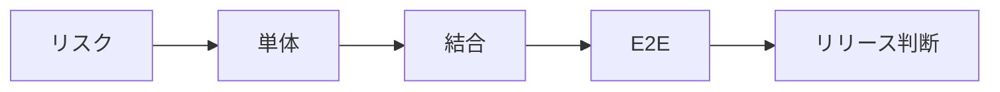

<!-- _class: title -->

# テスト戦略

単体、結合、E2E、手動確認の役割を分け、壊れやすい場所を守る。

- 本文資料: `docs/web/testing-strategy.md`
- 対象: JUnit + MockMvc + Playwright
- まず全体像、次に実務の判断、最後に確認手順を押さえる
- 各章では、現場で起こりやすい状況と小さなサンプルを一緒に見る

---

## 全体像



この図を入口に、どこで何を判断するかを追っていく。

> 実務例: テスト戦略の相談を受けたら、まず図のどの場所で問題が起きているかを言葉にする。

---

## テストの役割

- 速いテストでロジックを守り、結合テストで境界を守る。

> 実務例: テストの役割では、画面やAPIの入力が壊れたときに、どこで受け止めてどう返すかを決める。

```
unit: service
integration: repository/api
e2e: user flow
```

---

## 何を優先するか

- よく壊れる、影響が大きい、手動確認が面倒な場所から書く。

> 実務例: 何を優先するかでは、画面やAPIの入力が壊れたときに、どこで受け止めてどう返すかを決める。

```
login
payment
permission
```

---

## テストデータ

- 固定しすぎず、意図が分かる名前にする。

> 実務例: テストデータでは、画面やAPIの入力が壊れたときに、どこで受け止めてどう返すかを決める。

```
User activeUser = user("active@example.com");
```

---

## CI

- 不安定なテストは信頼を落とす。原因を直す。

> 実務例: CIでは、画面やAPIの入力が壊れたときに、どこで受け止めてどう返すかを決める。

```
pnpm build
mvn test
```

---

## テストピラミッド

- 単体を厚く、結合を必要十分に、E2Eは重要導線に絞る。
- E2Eでしか見えないものは、ブラウザ操作、画面遷移、配信後の崩れ。

> 実務例: テストピラミッドでは、画面やAPIの入力が壊れたときに、どこで受け止めてどう返すかを決める。

```
unit: many
integration: some
e2e: few but critical
```

---

## リスクベース

- 全機能を同じ厚さで守らない。
- 壊れたときの影響、変更頻度、過去の障害から優先順位を決める。

> 実務例: リスクベースでは、画面やAPIの入力が壊れたときに、どこで受け止めてどう返すかを決める。

```
risk = impact x likelihood
high risk -> automated first
```

---

## 境界の選び方

- DB境界、HTTP境界、外部API境界はテストの種類を分ける。
- 外部サービスはstubやmockで失敗系も作る。

> 実務例: 境界の選び方では、画面やAPIの入力が壊れたときに、どこで受け止めてどう返すかを決める。

```
service test
repository test
MockMvc
WireMock
```

---

## リリース前確認

- 自動テストだけでなく、実画面のスモーク確認を残す。
- 確認したURL、ブラウザ、結果をPRに書く。

> 実務例: リリース前確認では、画面やAPIの入力が壊れたときに、どこで受け止めてどう返すかを決める。

```
checked: /login
checked: /users
browser: chromium
```

---

## 実務で使う場面

- 画面や外部クライアントから来たリクエストを、安全にアプリの処理へ渡す場面で使う。
- APIの境界、入力検証、例外、設定、テストをそろえると変更に強くなる。

- この教材では **テスト戦略** を JUnit + MockMvc + Playwright の文脈で扱う。

---

## 判断の順番

- HTTPの責務と業務ロジックの責務を分ける。
- 外部公開のDTOと内部モデルを混ぜない。
- 正常系だけでなく、入力エラーと失敗時の応答を先に決める。

---

## サンプル確認

手元では、小さく動かして結果を見るところから始める。

```sh
curl -i -X POST http://localhost:8080/api/users \
  -H 'Content-Type: application/json' \
  -d '{"name":"Aki","email":"aki@example.com"}'
```

---

## よくある失敗

- Controllerに業務判断を詰め込みすぎる
- 入力エラーを全部500で返す
- secretや個人情報をログに出す

---

## チェックリスト

- Controller/APIの入出力をテストする
- ログにrequest idなどの追跡情報を入れる
- 設定値とsecretの出どころを確認する

---

## ミニ演習

- 小さなPOST APIを作る
- 未入力、形式不正、重複のテストを書く
- curlでstatusとbodyを確認する

---

## まとめ

- 目的と境界を先に決める
- 状態を確認してから変更する
- 具体例で動かし、ログや結果で確かめる
- 危険な操作は影響範囲を確認する
